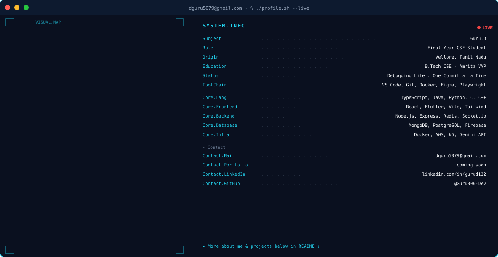

# Hello, World! I'm Guru.D 👋

  <picture>
    <source media="(prefers-color-scheme: dark)" srcset="./dark.svg">
    <source media="(prefers-color-scheme: light)" srcset="./light.svg">
    
  </picture>

  
  
  
  

---

## 🛠️ Toolchain & Tech Stack

> **Status:** Debugging Life · One Commit at a Time  
> **Role:**   Final Year CSE Student @ Amrita Vishwa Vidyapeetham  
> **Origin:** Vellore, Tamil Nadu  

| Category | Technologies & Frameworks |
| :--- | :--- |
| **Languages** | `TypeScript` `Java` `Python` `C` `C++` |
| **Frontend** | `React` `Flutter` `Vite` `TailwindCSS` |
| **Backend** | `Node.js` `Express.js` `Redis` `Socket.io` |
| **Databases** | `MongoDB` `PostgreSQL` `SQLite` `Firebase` |
| **Infra & DevOps** | `Docker` `AWS` `k6` `Playwright` `Jest` `Git` |

---

## 📊 GitHub Analytics

  
  

  

---

## 🐍 Contribution Graph

  <picture>
    <source media="(prefers-color-scheme: dark)" srcset="https://raw.githubusercontent.com/Guru006-Dev/Guru006-Dev/output/github-contribution-grid-snake-dark.svg">
    <source media="(prefers-color-scheme: light)" srcset="https://raw.githubusercontent.com/Guru006-Dev/Guru006-Dev/output/github-contribution-grid-snake.svg">
    
  </picture>

---

  ⚡ Built with precision & high-performance SVG animations for <b>Guru006-Dev</b>

